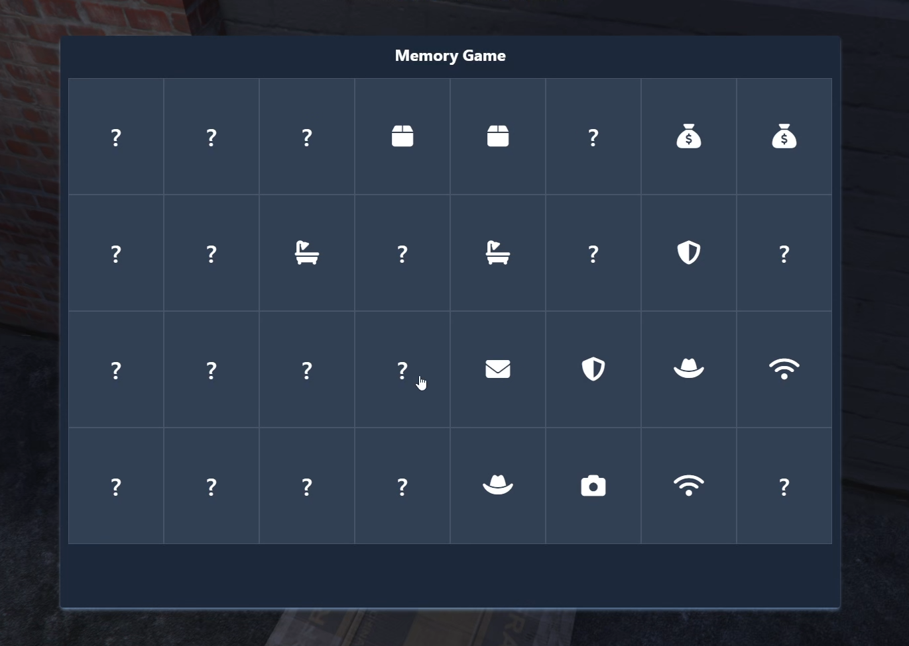
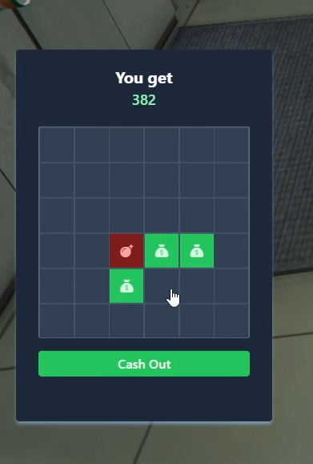
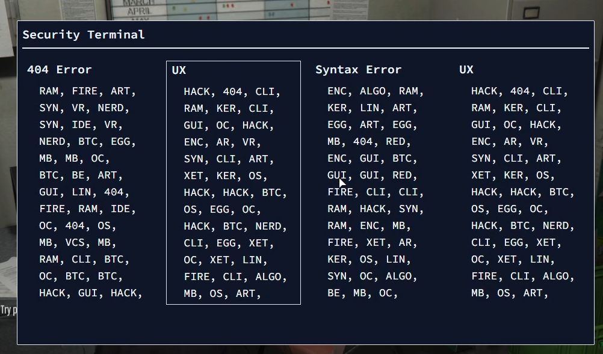

## Ran Minigames

### A collection of minigame (will expand more)

#### Memory Card Minigame



```lua
---time is optional, time is in minute
--[[
    return: boolean
]]
exports['ran-minigames']:MemoryCard(time)

-- Example
local success = exports['ran-minigames']:MemoryCard(360)
if success then
    --your logic here
end
```

#### Mine Sweep Minigame

Usually use it in a robbery script like my [store robbery](https://github.com/RanDXDev/ran-storerobbery)



```lua
--[[
    money, bomb, bombfail are required.
    money: number; (Maximum money amount to get)
    bomb: number; (How much bomb the minigame has)
    bombfail: number; (How much bomb limit we get to force cash out)
    position?: "left" | "right" | "center"
]]
exports['ran-minigames']:MineSweep(money, bomb, bombfail, position)

-- EXAMPLE
local success = exports['ran-minigames']:MineSweep(12000, 12, 3, "center")
-- Will return amount of money we get from minigame
print(success)
```

#### Terminal Text

I don't really know what to name this one 🥲, but the way it work is you need to find the same text on the right, in example I have to find `UX` and has a content `HACK, 404, CLI,... ETC`



```lua
--[[
    WILL RETURN A BOOLEAN
]]
 exports['ran-minigames']:OpenTerminal()

 -- EXAMPLE
 local success = exports['ran-minigames']:OpenTerminal()
```

### Support

[](https://discord.gg/eGkquvxhSf)

### License

<a rel="license" href="http://creativecommons.org/licenses/by-nc/4.0/"></a><br />This work is licensed under a <a rel="license" href="http://creativecommons.org/licenses/by-nc/4.0/">Creative Commons Attribution-NonCommercial 4.0 International License</a>.
